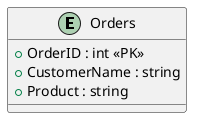
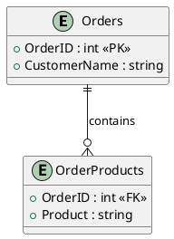
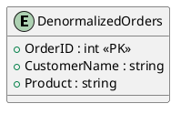

# Database Overview and Normalization Project

## Overview
This project aims to provide a detailed understanding of databases, their types, the normalization process, and the concept of denormalization. It includes visual representations of tables using PlantUML to clarify the concepts.

## Objectives
1. Define what a database is and its significance in data management.
2. Explain the different types of databases (e.g., relational, NoSQL, etc.).
3. Describe normalization, its purpose, and the various normal forms.
4. Provide detailed examples and diagrams to illustrate the normalization process.
5. Explain denormalization, its purpose, benefits, and drawbacks, with examples.

---

## 1. What is a Database?
A **database** is an organized collection of data that allows for efficient storage, retrieval, and management of information. Databases are essential for applications ranging from small-scale systems to large enterprise solutions. They provide a structured way to store data and facilitate data operations, such as querying, updating, and reporting.

### Key Characteristics of Databases:
- **Structured Data**: Data is organized in a systematic way, often in tables.
- **Data Integrity**: Databases ensure accuracy and consistency of data.
- **Data Security**: Access controls and authentication mechanisms protect sensitive data.
- **Multi-user Access**: Multiple users can access and manipulate data concurrently.
- **Data Relationships**: Databases can model complex relationships between different data entities.

---

## 2. Types of Databases
1. **Relational Databases**: Use structured query language (SQL) to define and manipulate data in tabular form. They enforce relationships through foreign keys. Examples include:
   - MySQL
   - PostgreSQL
   - Oracle Database

2. **NoSQL Databases**: Designed for unstructured or semi-structured data, offering flexibility and scalability. Examples include:
   - MongoDB (document-oriented)
   - Cassandra (column-family)
   - Redis (key-value store)

3. **In-memory Databases**: Store data in RAM for fast access, suitable for high-performance applications. Example:
   - Redis

4. **Graph Databases**: Use graph structures to represent and query relationships between data points. Example:
   - Neo4j

5. **Time-series Databases**: Optimized for handling time-stamped data. Example:
   - InfluxDB

---

## 3. Normalization
Normalization is the process of organizing data in a database to minimize redundancy and improve data integrity. This process involves dividing a database into tables and defining relationships between them.

### Purpose of Normalization:
- Reduce data redundancy.
- Eliminate undesirable characteristics like insertion, update, and deletion anomalies.
- Ensure data dependencies make sense.

### Normal Forms
- **First Normal Form (1NF)**: Ensures that each column contains atomic values and that each record is unique.
- **Second Normal Form (2NF)**: Must be in 1NF and all non-key attributes must be fully functionally dependent on the primary key.
- **Third Normal Form (3NF)**: Must be in 2NF and all attributes must be functionally dependent only on the primary key.

---

### Example of Normalization Process

#### Starting Data (Unnormalized)

| OrderID | CustomerName | Products            |
|---------|---------------|---------------------|
| 1       | Alice         | Laptop, Mouse       |
| 2       | Bob           | Keyboard, Monitor    |
| 3       | Alice         | Mouse, Headphones   |

**Issues:**
- Data redundancy (customer names and products).
- Products stored as a comma-separated list, which complicates data manipulation.

---

#### Step 1: First Normal Form (1NF)

**1NF Rule:** Each column must contain atomic values, and each record must be unique.

**Transformed Table:**

| OrderID | CustomerName | Product   |
|---------|---------------|-----------|
| 1       | Alice         | Laptop    |
| 1       | Alice         | Mouse     |
| 2       | Bob           | Keyboard   |
| 2       | Bob           | Monitor    |
| 3       | Alice         | Mouse     |
| 3       | Alice         | Headphones |

**PlantUML Diagram for 1NF:**




#### Step 2: Second Normal Form (2NF)

**2NF Rule:** Must be in 1NF and all non-key attributes must be fully functionally dependent on the primary key.

**Transformed Tables:**

1. **Orders Table:**

|OrderID|CustomerName|
|---|---|
|1|Alice|
|2|Bob|
|3|Alice|

2. **OrderProducts Table:**

|OrderID|Product|
|---|---|
|1|Laptop|
|1|Mouse|
|2|Keyboard|
|2|Monitor|
|3|Mouse|
|3|Headphones|

**PlantUML Diagram for 2NF:**




---

#### Step 3: Third Normal Form (3NF)

**3NF Rule:** Must be in 2NF and all attributes must be functionally dependent only on the primary key.

**Transformed Tables:**

1. **Orders Table:**

|OrderID|CustomerID|
|---|---|
|1|1|
|2|2|
|3|1|

2. **Customers Table:**

|CustomerID|CustomerName|
|---|---|
|1|Alice|
|2|Bob|

3. **OrderProducts Table:**

|OrderID|Product|
|---|---|
|1|Laptop|
|1|Mouse|
|2|Keyboard|
|2|Monitor|
|3|Mouse|
|3|Headphones|

**PlantUML Diagram for 3NF:**


```planuml
@startuml
entity "Orders" {
  + OrderID : int <<PK>>
  + CustomerID : int <<FK>>
}

entity "Customers" {
  + CustomerID : int <<PK>>
  + CustomerName : string
}

entity "OrderProducts" {
  + OrderID : int <<FK>>
  + Product : string
}

Customers ||--o{ Orders : places
Orders ||--o{ OrderProducts : contains
@enduml

```

---

## 4. Denormalization

**Definition:**  
Denormalization is the process of intentionally introducing redundancy into a database design. It is typically done to improve query performance at the expense of data integrity and storage efficiency.

### Purpose of Denormalization

1. **Performance Improvement**: Denormalization can speed up read operations by reducing the number of joins required to retrieve related data.
2. **Simplified Queries**: Denormalized tables can simplify complex queries, making them easier to write and maintain.
3. **Optimized for Reporting**: In data warehousing scenarios, denormalization is often used to optimize for reporting and analysis, where read operations dominate.

### Benefits of Denormalization

- **Faster Read Operations**: By having related data stored together, queries can be executed more quickly.
- **Reduced Complexity**: Simplified table structures can lead to easier query formulation and maintenance.
- **Better Performance for Aggregation**: Denormalized structures can improve the performance of aggregation operations in reporting.

### Drawbacks of Denormalization

- **Increased Data Redundancy**: Storing the same data in multiple places can lead to inconsistencies and anomalies.
- **More Complex Updates**: Updates become more complex because multiple records may need to be updated simultaneously.
- **Higher Storage Costs**: More storage may be required due to duplicated data.

---

### Example of Denormalization

#### Scenario

Consider a simplified e-commerce database that includes orders and customers. After normalization, you might have the following tables:

1. **Customers Table**

|CustomerID|CustomerName|
|---|---|
|1|Alice|
|2|Bob|

2. **Orders Table**

|OrderID|CustomerID|
|---|---|
|1|1|
|2|2|
|3|1|

3. **OrderProducts Table**

|OrderID|Product|
|---|---|
|1|Laptop|
|1|Mouse|
|2|Keyboard|
|3|Mouse|

#### Denormalized Table

To optimize for read performance, you might create a denormalized table that combines data from the Customers, Orders, and OrderProducts tables:

**DenormalizedOrders Table**

|OrderID|CustomerName|Product|
|---|---|---|
|1|Alice|Laptop|
|1|Alice|Mouse|
|2|Bob|Keyboard|
|3|Alice|Mouse|

**PlantUML Diagram for Denormalization:**




#### Explanation

- **Redundancy**: The `CustomerName` is repeated for each order associated with that customer.
- **Simplified Queries**: To retrieve all orders with customer names and products, a simple SELECT query can be executed on the `DenormalizedOrders` table instead of joining multiple tables.

**Query Example:**


```sql
SELECT * FROM DenormalizedOrders WHERE CustomerName = 'Alice';
```

This query can be executed quickly without the need for complex joins, providing results like:

|OrderID|CustomerName|Product|
|---|---|---|
|1|Alice|Laptop|
|1|Alice|Mouse|
|3|Alice|Mouse|

---

## Conclusion

This project outlines the fundamental concepts of databases, their types, and the normalization and denormalization processes. The detailed examples illustrate how data evolves from an unnormalized form through various normal forms, ultimately resulting in a structured and efficient database design. Understanding when and how to normalize and denormalize is critical for creating effective database systems.
